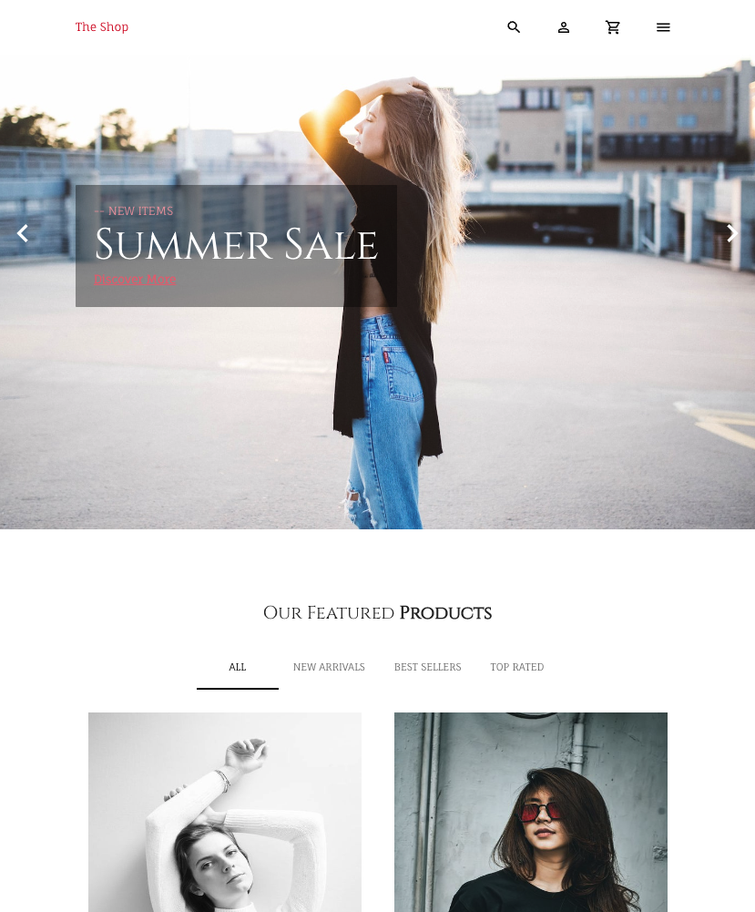
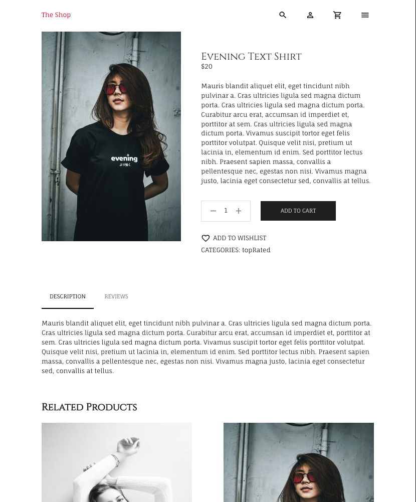
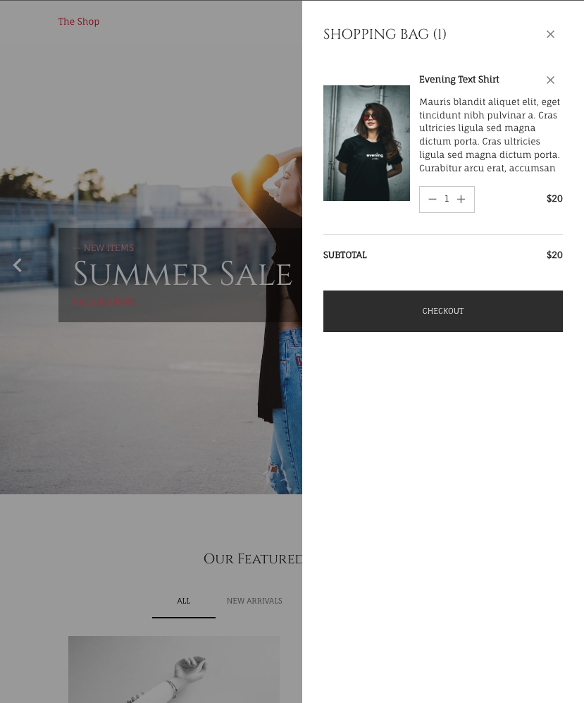
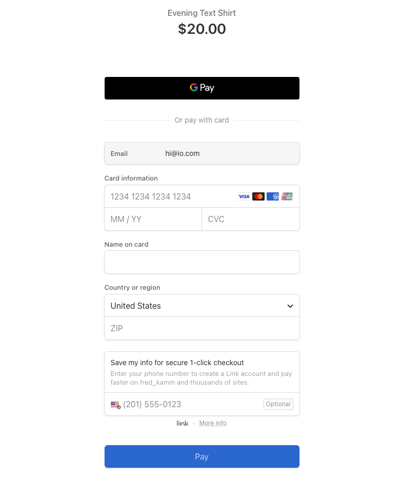

# Shop-app-react

This is a simple e-commerce website using react and redux in the front end; Strapi for the back end; and Stripe for the payment system.

# Inspiration

Building a fully functioning and also responsive e-commerce site is something i wanted to accomplish since starting my coding journey. I'm happy I was able to display some of my skills while creating this application.

# Future Development
- Users create an account
- Users have their own profile page
- Search Functionality
- Wish-list functionality 

# Usage

    <a href="https://fredkammweatherapp.netlify.app/">
        Click here to visit my app!
    </a>

 

    
    
    
    

# Tools Used

- 
- 
- 
- 
- 
- 

# Questions

    
Any questions or would like to collaborate Please shoot me an <a href="mailto:fred.kamm95@gmail.com"> Email </a>

    
If you would like to view more of my work  Visit my <a href="https://github.com/fredkamm ">Github</a> profile

